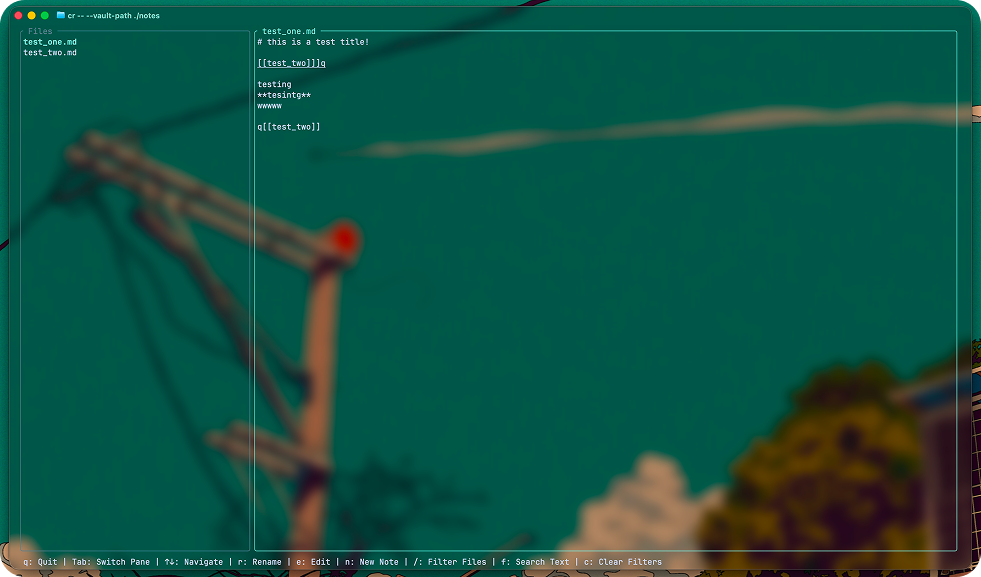

# lrn

A Markdown Note taking TUI made in Rust.



## Installation

### Windows (Recommended: Installer)

1. Download the latest release from [GitHub Releases](https://github.com/LHagfoss/lrn/releases)
2. Download `lrn-windows-x86_64.exe` — this is a portable binary. You can double-click it to run, or add its folder to your PATH so you can just type `lrn` in any terminal.

### Linux

1. Download the latest release from [GitHub Releases](https://github.com/LHagfoss/lrn/releases)
2. Make it executable and move it to your PATH:

```bash
chmod +x lrn-linux-x86_64
sudo mv lrn-linux-x86_64 /usr/local/bin/lrn
```

3. Run `lrn` in your terminal.

### macOS

Coming soon — Homebrew support will be added once the first stable release ships.

## Building from source

Requires Rust and Cargo to be installed. See [rust-lang.org](https://www.rust-lang.org/tools/install).

```bash
git clone git@github.com:LHagfoss/lrn.git
cd lrn
cargo install --path .
lrn
```

